# Jarkom-Modul-1-2026-K-44

| Nama |  NRP |
| --- | --- |
| Nayarfa Syamahira Dyananta | 5027251046 |
| Rido Patra Yudhistira Edwin | 5027251120 |

## **Soal 1: Topologi & Konfigurasi IP Address**

> **Deskripsi Soal:**
> Lain yang berperan sebagai Router membuat tiga Switch/Gateway:
> 
> * **Switch 1:** menuju entitas **Alice** dan **Mika**
> 
> * **Switch 2:** menuju entitas **Chisa**
> 
> * **Switch 3:** menuju entitas **Knights** dan **Eiri**
> 
> Kelima entitas dikonfigurasi sebagai **Client** di GNS3 menggunakan IP Prefix kelompok.

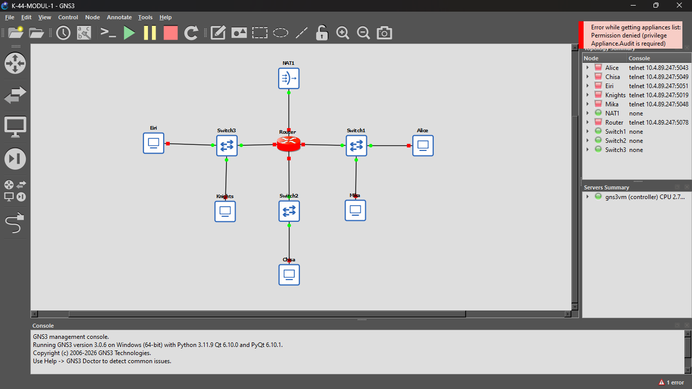

---

### **1. Rancangan Topologi & Pembagian IP Address**

Berikut adalah pemetaan interface dan pengalamatan IP yang disesuaikan dengan skema Subnetting.

Prefix IP: `192.233.x.x`

| Node | Type | Interface | IP Address / Netmask | Default Gateway | Terhubung Ke |
| --- | --- | --- | --- | --- | --- |
| **Lain** | Router | `eth0` | DHCP (NAT) | Auto (dari NAT) | Internet / NAT GNS3 |
|  |  | `eth1` | `192.233.1.1/24` | - | Switch 1 |
|  |  | `eth2` | `192.233.2.1/24` | - | Switch 2 |
|  |  | `eth3` | `192.233.3.1/24` | - | Switch 3 |
| **Alice** | Client | `eth0` | `192.233.1.2/24` | `192.233.1.1` | Switch 1 |
| **Mika** | Client | `eth0` | `192.233.1.3/24` | `192.233.1.1` | Switch 1 |
| **Chisa** | Client | `eth0` | `192.233.2.2/24` | `192.233.2.1` | Switch 2 |
| **Knights** | Client | `eth0` | `192.233.3.2/24` | `192.233.3.1` | Switch 3 |
| **Eiri** | Client | `eth0` | `192.233.3.3/24` | `192.233.3.1` | Switch 3 |

---

### **2. Script Konfigurasi Per Node**

Sesuai **Aturan Praktikum Poin 5**, semua script wajib diletakkan di direktori `/root`.

---

#### **A. Router Lain**

Buka console node **Lain**, buat script `/root/setup_lain.sh`:

```sh
cat << 'EOF' > /root/setup_lain.sh
#!/bin/sh

# Atur IP Address pada interface internal
ip addr add 192.233.1.1/24 dev eth1
ip link set dev eth1 up

ip addr add 192.233.2.1/24 dev eth2
ip link set dev eth2 up

ip addr add 192.233.3.1/24 dev eth3
ip link set dev eth3 up

echo "Konfigurasi IP pada Router Lain selesai."
EOF

chmod +x /root/setup_lain.sh
sh /root/setup_lain.sh
```

---

#### **B. Client Alice (di bawah Switch 1)**

Buka console node **Alice**, buat script `/root/setup_alice.sh`:

```sh
cat << 'EOF' > /root/setup_alice.sh
#!/bin/sh

ip addr add 192.233.1.2/24 dev eth0
ip link set dev eth0 up

echo "Konfigurasi IP Alice selesai."
EOF

chmod +x /root/setup_alice.sh
sh /root/setup_alice.sh
```

---

#### **C. Client Mika (di bawah Switch 1)**

Buka console node **Mika**, buat script `/root/setup_mika.sh`:

```sh
cat << 'EOF' > /root/setup_mika.sh
#!/bin/sh

ip addr add 192.233.1.3/24 dev eth0
ip link set dev eth0 up
ip route add default via 192.233.1.1

echo "Konfigurasi IP Mika selesai."
EOF

chmod +x /root/setup_mika.sh
sh /root/setup_mika.sh
```

---

#### **D. Client Chisa (di bawah Switch 2)**

Buka console node **Chisa**, buat script `/root/setup_chisa.sh`:

```sh
cat << 'EOF' > /root/setup_chisa.sh
#!/bin/sh

ip addr add 192.233.2.2/24 dev eth0
ip link set dev eth0 up
ip route add default via 192.233.2.1

echo "Konfigurasi IP Chisa selesai."
EOF

chmod +x /root/setup_chisa.sh
sh /root/setup_chisa.sh
```

---

#### **E. Client Knights (di bawah Switch 3)**

Buka console node **Knights**, buat script `/root/setup_knights.sh`:

```sh
cat << 'EOF' > /root/setup_knights.sh
#!/bin/sh

ip addr add 192.233.3.2/24 dev eth0
ip link set dev eth0 up
ip route add default via 192.233.3.1

echo "Konfigurasi IP Knights selesai."
EOF

chmod +x /root/setup_knights.sh
sh /root/setup_knights.sh
```

---

#### **F. Client Eiri (di bawah Switch 3)**

Buka console node **Eiri**, buat script `/root/setup_eiri.sh`:

```sh
cat << 'EOF' > /root/setup_eiri.sh
#!/bin/sh

ip addr add 192.233.3.3/24 dev eth0
ip link set dev eth0 up
ip route add default via 192.233.3.1

echo "Konfigurasi IP Eiri selesai."
EOF

chmod +x /root/setup_eiri.sh
sh /root/setup_eiri.sh
```

---

### **3. Verifikasi Soal 1**

Untuk memastikan Soal 1 selesai dengan baik, jalankan perintah berikut di masing-masing node:

* Pada **Router Lain** dan **Client**:

```sh
ip -br a
```

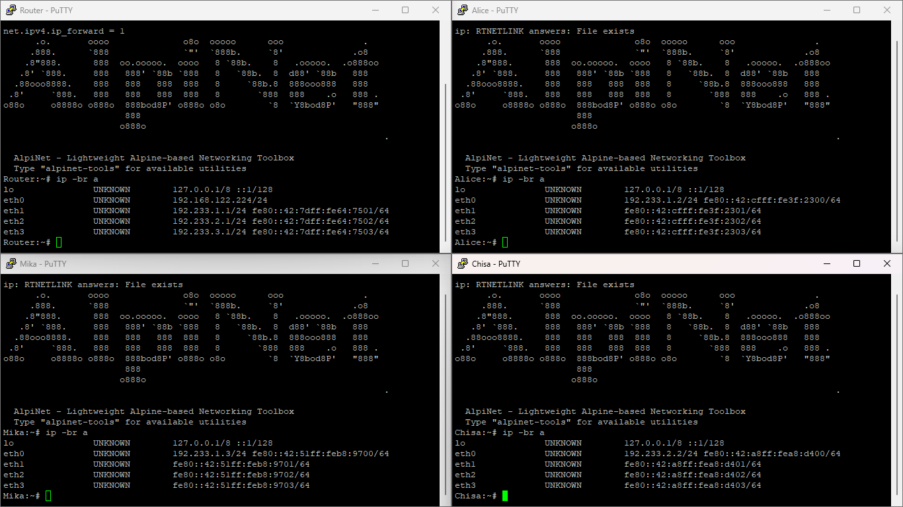

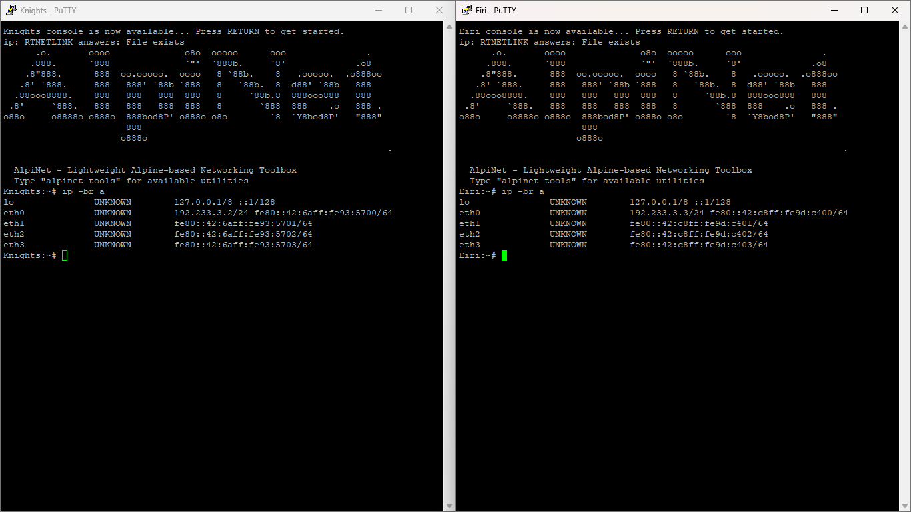

---

## **Soal 2: Konfigurasi Lain ke Public Network**

Jalankan script ini di node **Router Lain** (`/root/setup_lain.sh`):

```sh
cat << 'EOF' >> /root/setup_lain.sh

# Aktifkan eth0 dan minta IP via DHCP
ip link set dev eth0 up
udhcpc -i eth0

echo "Konfigurasi DHCP Router Lain selesai."
EOF

sh /root/setup_lain.sh
```

`udhcpc -i eth0`: Perintah ini akan meminta IP, default gateway, dan DNS otomatis dari server DHCP ke interface eth0.

Jalankan perintah `ping -c 5 8.8.8.8` di terminal Router Lain. Jika muncul respons *reply*, berarti interface `eth0` berhasil mendapatkan IP DHCP dan terhubung ke internet.

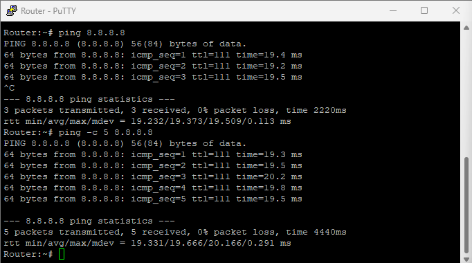

---

## **Soal 3: Komunikasi Antar Client**

Pada nomor 3, tujuannya membuat seluruh Entitas (Alice, Mika, Chisa, Knights, Eiri) saling terhubung lintas subnet via router Lain. Karena ketiga switch terhubung langsung ke port router (`eth1`, `eth2`, `eth3`), kamu cukup mengaktifkan **Kernel IP Forwarding** di Router Lain.

---

**Konfigurasi di Node Router Lain**

* **Router Lain:**

```sh
sysctl -w net.ipv4.ip_forward=1
```

**Konfigurasi di Node Client**

* **Node Alice** (Subnet `eth1` - `192.233.1.0/24`)

```sh
ip route add default via 192.233.1.1
```

* **Node Mika** (Subnet `eth1` - `192.233.1.0/24`)

```sh
ip route add default via 192.233.1.1
```

* **Node Chisa** (Subnet `eth2` - `192.233.2.0/24`)

```sh
ip route add default via 192.233.2.1
```

* **Node Knights** (Subnet `eth3` - `192.233.3.0/24`)

```sh
ip route add default via 192.233.3.1
```

* **Node Eiri** (Subnet `eth3` - `192.233.3.0/24`)

```sh
ip route add default via 192.233.3.1
```

---

**Cara Verifikasi Nomor 3**

Lakukan uji tes koneksi silang antar-subnet. Coba jalankan perintah berikut di terminal node **Alice** (`192.233.1.2`):

* Ping ke Chisa (Subnet 2): `ping -c 3 192.233.2.2`
* Ping ke Eiri (Subnet 3): `ping -c 3 192.233.3.3`

Jika paket *reply* diterima, konfigurasi routing antar-entitas sudah berhasil.

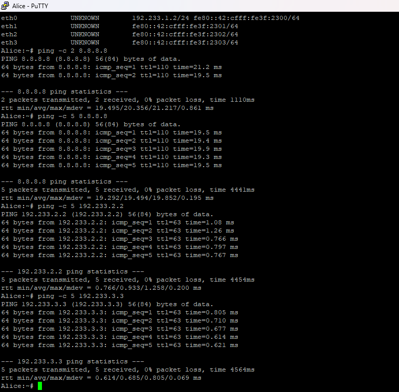

---

## **Soal 4: NAT Masquerade dan DNS Resolver**

Mengatur **NAT Masquerade** di Router Lain dan mendaftarkan **DNS Resolver** di setiap node Client.

---

**1. Konfigurasi NAT Masquerade di Router Lain**

Jalankan perintah `iptables` ini di terminal **Router Lain** agar paket IP privat dari semua client disamarkan menggunakan IP `eth0` saat keluar ke internet:

```sh
iptables -t nat -A POSTROUTING -o eth0 -j MASQUERADE
```

---

**2. Konfigurasi DNS Resolver di Setiap Node Client**

Jalankan perintah berikut di terminal **semua Client** (Alice, Mika, Chisa, Knights, dan Eiri) untuk mengeset DNS resolver ke `8.8.8.8`:

```sh
echo "nameserver 8.8.8.8" > /etc/resolv.conf
```

---

**3. Verifikasi Konektivitas Client**

Buka terminal di salah satu client (misalnya **Alice** atau **Mika**) dan uji konektivitas internetnya:

* Ping IP publik: `ping -c 3 8.8.8.8`

* Ping domain web: `ping -c 3 google.com`

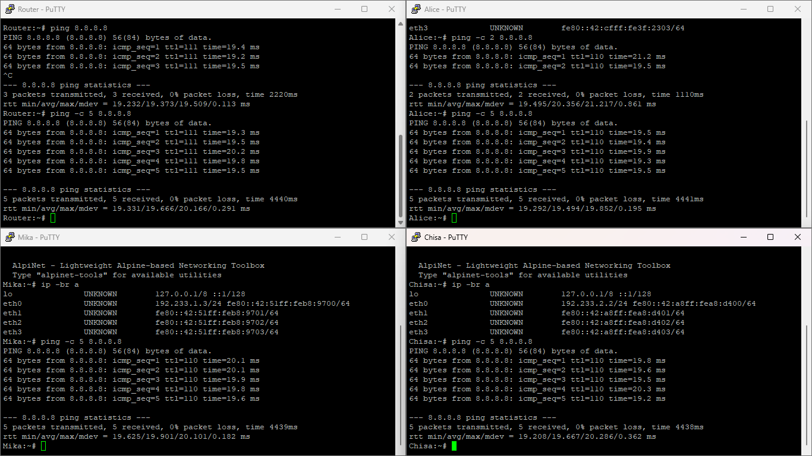

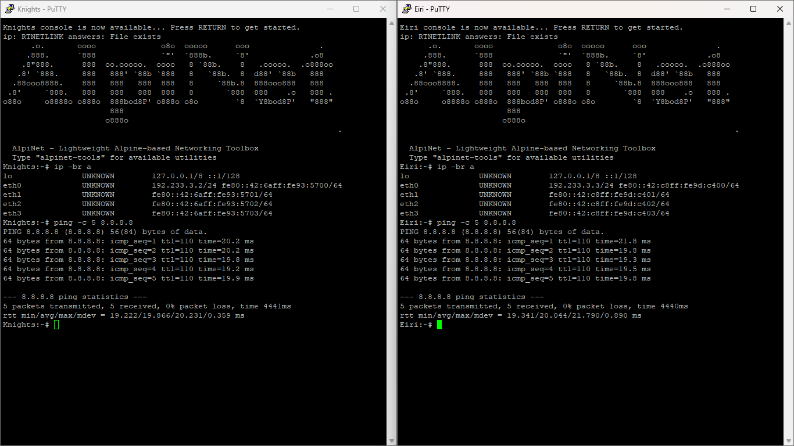

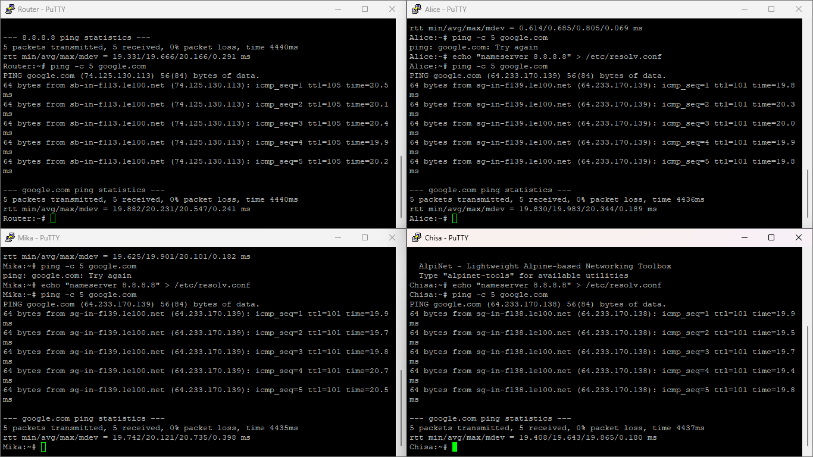

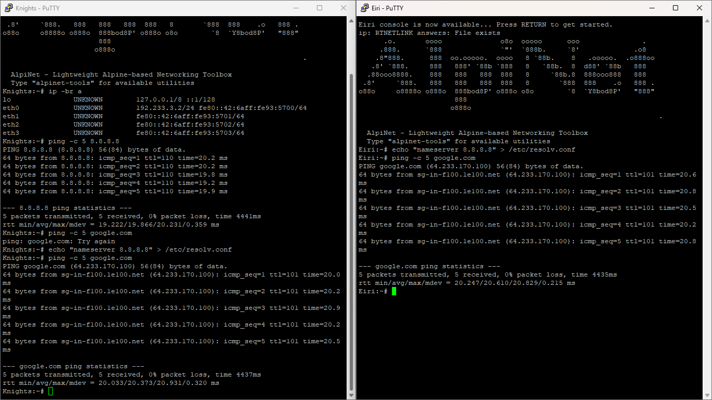

---

## **Soal 5: Skrip Verifikasi dan Persistensi Konfigurasi**

**1. Buat Script `/root/cek_status.sh**`

```sh
cat << 'EOF' > /root/cek_status.sh
#!/bin/bash
echo "=== RINGKASAN INTERFACE ==="
ip -br a
echo ""
echo "=== STATUS TABEL NAT ==="
iptables -t nat -L -v -n
EOF

chmod +x /root/cek_status.sh
```

---

**2. Verifikasi Persistensi Konfigurasi**

* **Router Lain:**

```sh
cat << 'EOF' > /etc/network/interfaces
auto lo
iface lo inet loopback

auto eth0
iface eth0 inet dhcp
    up sysctl -w net.ipv4.ip_forward=1
    up iptables -t nat -A POSTROUTING -o eth0 -j MASQUERADE

auto eth1
iface eth1 inet static
    address 192.233.1.1
    netmask 255.255.255.0

auto eth2
iface eth2 inet static
    address 192.233.2.1
    netmask 255.255.255.0

auto eth3
iface eth3 inet static
    address 192.233.3.1
    netmask 255.255.255.0
EOF

service networking restart
```

* **Client Alice** (Subnet `eth1` - Gateway `192.233.1.1`)

```sh
cat << 'EOF' > /etc/network/interfaces
auto lo
iface lo inet loopback

auto eth0
iface eth0 inet static
    address 192.233.1.2
    netmask 255.255.255.0
    gateway 192.233.1.1
EOF

service networking restart
```

---

* **Client Mika** (Subnet `eth1` - Gateway `192.233.1.1`)

```sh
cat << 'EOF' > /etc/network/interfaces
auto lo
iface lo inet loopback

auto eth0
iface eth0 inet static
    address 192.233.1.3
    netmask 255.255.255.0
    gateway 192.233.1.1
EOF

service networking restart
```

---

* **Client Chisa** (Subnet `eth2` - Gateway `192.233.2.1`)

```sh
cat << 'EOF' > /etc/network/interfaces
auto lo
iface lo inet loopback

auto eth0
iface eth0 inet static
    address 192.233.2.2
    netmask 255.255.255.0
    gateway 192.233.2.1
EOF

service networking restart
```

---

* **Client Knights** (Subnet `eth3` - Gateway `192.233.3.1`)

```sh
cat << 'EOF' > /etc/network/interfaces
auto lo
iface lo inet loopback

auto eth0
iface eth0 inet static
    address 192.233.3.2
    netmask 255.255.255.0
    gateway 192.233.3.1
EOF

service networking restart
```

---

* **Client Eiri** (Subnet `eth3` - Gateway `192.233.3.1`)

```sh
cat << 'EOF' > /etc/network/interfaces
auto lo
iface lo inet loopback

auto eth0
iface eth0 inet static
    address 192.233.3.3
    netmask 255.255.255.0
    gateway 192.233.3.1
EOF

service networking restart
```

---

**3. Pengujian**

Jalankan script verifikasi dengan perintah:

```sh
/root/cek_status.sh
```

Coba *restart* node Router Lain di GNS3, lalu jalankan kembali `/root/cek_status.sh`. Jika daftar interface dan aturan `MASQUERADE` tetap muncul setelah reboot, berarti sudah benar.

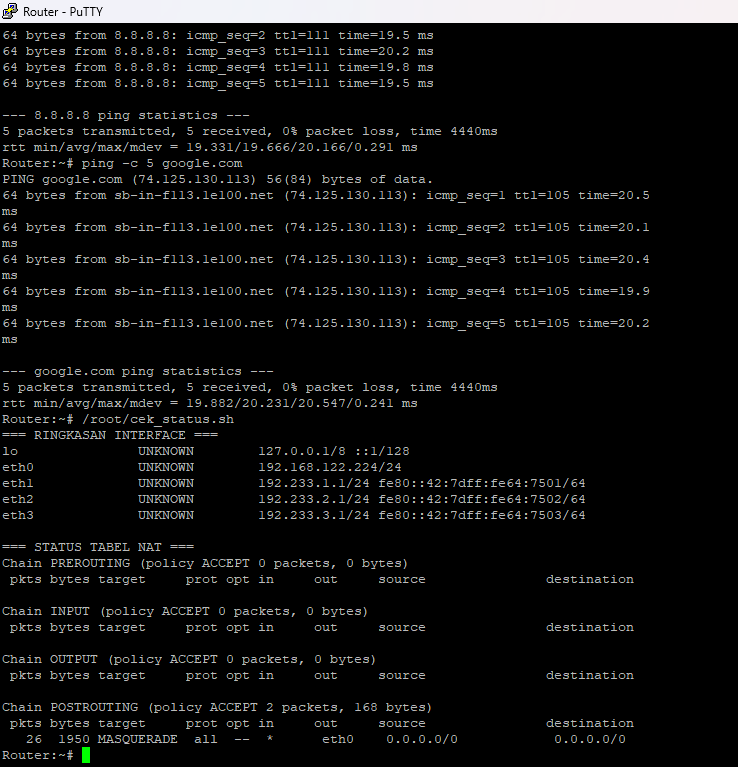

---

## **Soal 6: Packet Sniffing**

**1. Persiapan & Pembuatan Skrip di Node Mika**

Pastikan paket `bind-tools` sudah terinstal di node Mika agar perintah `dig` dan `nslookup` dapat dijalankan. Gunakan `#!/bin/sh` agar kompatibel penuh dengan Alpinet.

Jalankan perintah ini di terminal **Mika**:

```sh
# Install tools DNS (dig dan nslookup) di Alpinet
apk add bind-tools

# Buat berkas traffic_protocol7.sh
cat << 'EOF' > /root/traffic_protocol7.sh
#!/bin/sh
echo "============================================"
echo "  Protocol 7 Traffic Generator v2026"
echo "  Node: Mika Iwakura"
echo "============================================"
echo "[*] Generating DNS & ICMP traffic..."

# ICMP Traffic
ping -c 5 8.8.8.8 &
ping -c 5 1.1.1.1 &
ping -c 3 its.ac.id &

# DNS Queries
nslookup google.com 8.8.8.8 &
nslookup its.ac.id 8.8.8.8 &
nslookup github.com 1.1.1.1 &
dig @8.8.8.8 example.com A &
dig @1.1.1.1 cloudflare.com AAAA &

wait
echo "[*] Traffic generation complete."
echo "[*] Check Wireshark for captured packets."
EOF

chmod +x /root/traffic_protocol7.sh
```

---

**2. Langkah Kerja Packet Sniffing di Wireshark**

1. Klik kanan pada link kabel antara **Mika (eth0)** dan **Switch 1** di canvas GNS3, lalu pilih **Start capture**.

2. Buka terminal node **Mika**, lalu jalankan skrip generator:
```bash
sh /root/traffic_protocol7.sh
```

3. Setelah eksekusi skrip selesai, buka jendela Wireshark lalu masukkan perintah berikut pada bagian *Display Filter*:
```text
dns or icmp
```

---

**3. Ringkasan Paket yang Lolos Filter**

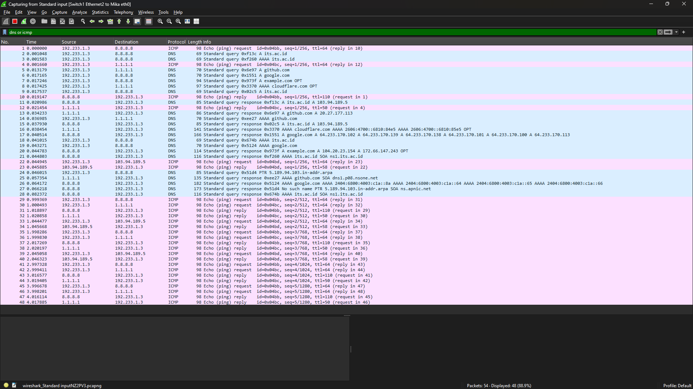

* **Identitas Node Klien**: Node Mika (`192.233.1.3`).

* **Trafik ICMP (Ping)**:
* 5 pasang *Echo Request* dan *Echo Reply* ke IP `8.8.8.8`.
* 5 pasang *Echo Request* dan *Echo Reply* ke IP `1.1.1.1`.
* 3 pasang *Echo Request* dan *Echo Reply* ke host `its.ac.id` (`103.94.189.5`).

* **Trafic DNS (Domain Name System)**:
* *Standard Query* & *Response* (Record A) untuk domain `google.com` dan `its.ac.id` via DNS Server `8.8.8.8`.
* *Standard Query* & *Response* (Record A) untuk domain `github.com` via DNS Server `1.1.1.1`.
* *Standard Query* & *Response* (`dig` Record A) untuk domain `example.com` via DNS Server `8.8.8.8`.
* *Standard Query* & *Response* (`dig` Record AAAA IPv6) untuk domain `cloudflare.com` via DNS Server `1.1.1.1`.

---

Berikut penyesuaian lengkap dokumen **Soal 7 (FTP Server)** yang sudah disesuaikan dengan penggunaan *tool* **`lftp`** pada Alpinet beserta hasil eksekusi aktualnya:

---

## **Soal 7: FTP Server (`vsftpd`)**

### 1. Konfigurasi FTP Server di Node Chisa (`192.233.2.2`)

Jalankan skrip ini di terminal **Chisa** untuk menginstal `vsftpd`, membuat direktori shared `/var/wired/data`, mengonfigurasi *userlist blacklist*, serta mengatur direktori konfigurasi per-*user* (`/etc/vsftpd_user_config`):

```sh
cat << 'EOF' > /root/setup_ftp_chisa.sh
#!/bin/sh
apk update && apk add vsftpd

# Buat direktori penyimpanan data dan secure chroot
mkdir -p /var/wired/data
mkdir -p /usr/share/vsftpd/empty
chmod 777 /var/wired/data

# Buat akun user sistem di Alpine
adduser -D -s /bin/sh alice 2>/dev/null || true
adduser -D -s /bin/sh mika 2>/dev/null || true
adduser -D -s /bin/sh eiri 2>/dev/null || true

# Set password user
echo "alice:alice123" | chpasswd
echo "mika:mika123" | chpasswd
echo "eiri:eiri123" | chpasswd

# Konfigurasi utama vsftpd
mkdir -p /etc/vsftpd
cat << 'CONF' > /etc/vsftpd/vsftpd.conf
anonymous_enable=NO
local_enable=YES
write_enable=YES
dirmessage_enable=YES
use_localtime=YES
xferlog_enable=YES
connect_from_port_20=YES
secure_chroot_dir=/usr/share/vsftpd/empty
seccomp_sandbox=NO

local_root=/var/wired/data
allow_writeable_chroot=YES

# Blacklist user eiri
userlist_enable=YES
userlist_file=/etc/vsftpd.userlist
userlist_deny=YES

# Konfigurasi per-user
user_config_dir=/etc/vsftpd_user_config
CONF

# Masukkan user eiri ke daftar blacklist
echo "eiri" > /etc/vsftpd.userlist
echo "eiri" >> /etc/ftpusers

# Atur izin khusus per user (alice = Read/Write, mika = Read-Only)
mkdir -p /etc/vsftpd_user_config
echo "write_enable=YES" > /etc/vsftpd_user_config/alice
echo "write_enable=NO" > /etc/vsftpd_user_config/mika

# Restart daemon vsftpd
pkill vsftpd || true
vsftpd /etc/vsftpd/vsftpd.conf &
echo "FTP Server vsftpd berhasil dikonfigurasi di Chisa."
EOF

chmod +x /root/setup_ftp_chisa.sh
sh /root/setup_ftp_chisa.sh
```

---

### 2. Langkah Pengujian & Verifikasi Hak Akses Klien

Gunakan `lftp` di node klien karena lebih ringkas dan mendukung sintaks interaktif.

**A. Verifikasi Hak Akses Read & Write di Node Alice**
Jalankan perintah berikut di terminal **Alice**:
```sh
apk update && apk add lftp
echo "Pesan rahasia dari Alice" > /root/signal_alice.txt
lftp -u alice,alice123 192.233.2.2
```

Setelah masuk ke *prompt* `lftp alice@192.233.2.2:~>`, jalankan:
```text
put /root/signal_alice.txt
ls
quit
```

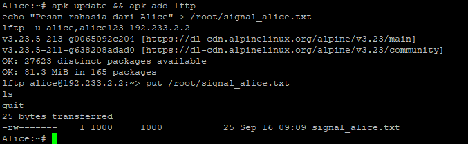

* **Hasil:** Terlihat respons `25 bytes transferred` dan file `signal_alice.txt` berhasil terunggah ke server.

**B. Verifikasi User Blacklist di Node Eiri**
Jalankan perintah berikut di terminal **Eiri**:
```sh
apk update && apk add lftp
lftp -u eiri,eiri123 192.233.2.2
```

Setelah masuk ke *prompt* `lftp eiri@192.233.2.2:~>`, jalankan perintah:
```text
ls
quit
```

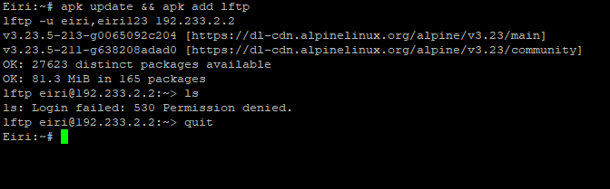

* **Hasil:** Server langsung memblokir akses login dengan pesan error `ls: Login failed: 530 Permission denied.`.

---

## **Soal 8: FTP Upload Knights Report**

### 1. Skrip Automation pada Node Knights (`192.233.3.2`)

Jalankan perintah ini di terminal node **Knights** untuk mengunggah berkas laporan `knights_report.txt` ke FTP Server Chisa (`192.233.2.2`) menggunakan kredensial `alice` dalam mode pasif (*passive mode*):

```sh
cat << 'EOF' > /root/upload_knights_report.sh
#!/bin/sh
apk update && apk add lftp 2>/dev/null || true

# Buat berkas laporan Knights
cat << 'REPORT' > /root/knights_report.txt
==================================================
  KNIGHTS OF THE EASTERN CALCULUS — STATUS REPORT
  Protocol 7 Surveillance Network
  Classification: LEVEL 7 — EYES ONLY
==================================================

Date: [CLASSIFIED]
Agent: Knights Unit Alpha
Node: Switch 3 — Subnet 192.233.3.0/24

---

SUBJECT: Network Reconnaissance Report

The Wired has been successfully infiltrated through
Protocol 7 channels. Current observations:

1. Router "Lain" has been identified as the central
   gateway node connecting all three subnet segments.

2. Switch 1 (192.233.1.0/24) hosts Alice and Mika.
   Both nodes show standard traffic patterns.

3. Switch 2 (192.233.2.0/24) hosts Chisa alone.
   Isolated subnet — minimal cross-traffic observed.

4. Switch 3 (192.233.3.0/24) — our operational base.
   Knights and Eiri coexist on this segment.

RECOMMENDATION:
Continue monitoring FTP and Telnet sessions for
plaintext credential exposure. SSH tunnels remain
impenetrable without keylog access.

--- END OF REPORT ---
Knights of the Eastern Calculus
"Let's all love Lain."

REPORT

# Unggah berkas ke FTP Server Chisa via lftp (Passive Mode)
lftp -u alice,alice123 192.233.2.2 << 'FTP'
set ftp:passive-mode true
put /root/knights_report.txt
ls
quit
FTP
EOF

chmod +x /root/upload_knights_report.sh
sh /root/upload_knights_report.sh
```

### 2. Langkah Kerja & Packet Sniffing

1. Aktifkan fitur *packet capture* pada link kabel **Knights (eth0)** atau **Router Lain** di GNS3.
2. Eksekusi skrip di terminal **Knights**:
```sh
sh /root/upload_knights_report.sh
```

3. Buka Wireshark, lalu gunakan *Display Filter* berikut pada baris penyaringan:
```text
ftp or ftp-data
```

### 3. Ringkasan Bukti Tangkapan Paket Wireshark (Untuk Laporan)

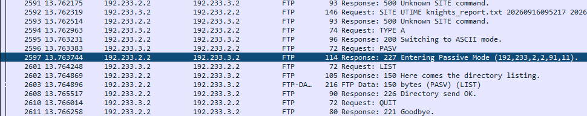

* **Negosiasi Passive Mode (`227 Entering Passive Mode`)**:
* Client Knights (`192.233.3.2`) mengirimkan perintah `PASV`.
* FTP Server Chisa (`192.233.2.2`) merespons dengan `227 Entering Passive Mode (192,233,2,2,91,11)`. Port data pasif dibuka pada kombinasi oktet $91 \times 256 + 11 = 23307$.

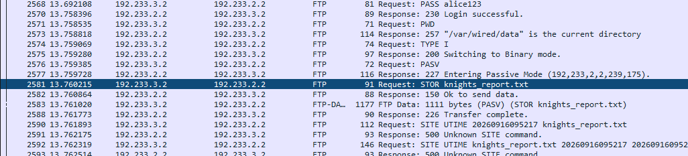

* **Perintah Upload File (`STOR`)**:
* Client mengirimkan perintah `Request: STOR knights_report.txt`.
* Server membalas dengan `150 Ok to send data` lalu menerima *stream* data pada saluran `FTP-DATA`.

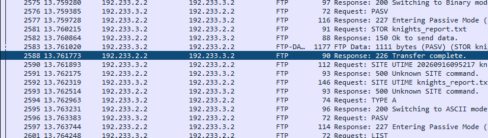

* **Konfirmasi Transfer Selesai (`226 Transfer complete`)**:
* Setelah seluruh isi berkas terkirim, server memberikan respons `Response: 226 Transfer complete.`.

---

## **Soal 9: FTP Read-Only Test (Mika)**

### 1. Konfigurasi File Manifesto di Server Chisa (`192.233.2.2`)

Jalankan skrip ini di terminal **Chisa** untuk membuat berkas `protocol7_manifesto.txt` di dalam folder terbagi `/var/wired/data`:

```sh
cat << 'EOF' > /root/setup_manifesto_chisa.sh
#!/bin/sh
mkdir -p /var/wired/data

cat << 'MANIFESTO' > /var/wired/data/protocol7_manifesto.txt
==================================================
  PROTOCOL 7 — THE MANIFESTO
  A Declaration of Digital Consciousness
  Serial Experiments Lain — Year 2026
==================================================

ARTICLE I: THE NATURE OF THE WIRED
-----------------------------------
The Wired is not merely a network of interconnected
machines. It is the collective unconscious of
humanity, rendered in packets and protocols.

Every TCP handshake is a conversation.
Every DNS query is a question.
Every encrypted tunnel is a whispered secret.

ARTICLE II: THE SEVEN PRINCIPLES
----------------------------------
1. All nodes are equal in the eyes of the router.
2. No packet shall be dropped without cause.
3. Encryption is the right of every connection.
4. Plaintext protocols expose the vulnerable.
5. The firewall protects, but also imprisons.
6. NAT masquerade hides truth behind a single face.
7. The Wired remembers everything — packet loss
   is merely a temporary forgetting.

ARTICLE III: THE PROPHECY OF LAIN
-----------------------------------
"If you're not remembered, then you never existed."

In the world of networking, persistence is survival.
A configuration that vanishes upon restart is a
thought that was never truly committed to memory.

Therefore: Save your iptables. Write your interfaces.
Let your routing tables endure beyond the power cycle.

ARTICLE IV: CONCERNING SECURITY
---------------------------------
Telnet is the glass house of protocols — transparent
to any observer with a packet sniffer.

SSH is the steel vault — its contents visible only
to those who possess the key.

Choose wisely which door you open to The Wired.

---
"No matter where you go, everyone's connected."
— Lain Iwakura
MANIFESTO

echo "Berkas manifesto berhasil dibuat di /var/wired/data."
EOF

chmod +x /root/setup_manifesto_chisa.sh
sh /root/setup_manifesto_chisa.sh
```

### 2. Langkah Kerja di Node Mika (`192.233.1.3`)

Jika ingin menjalankan perintah satu per satu di terminal **Mika**:

```sh
# 1. Unduh file manifesto (Read Test)
lftp -u mika,mika123 192.233.2.2
get protocol7_manifesto.txt
cat protocol7_manifesto.txt

# 2. Coba unggah file baru (Write Test)
put /root/test_mika.txt
quit
```

### 3. Hasil Analisis

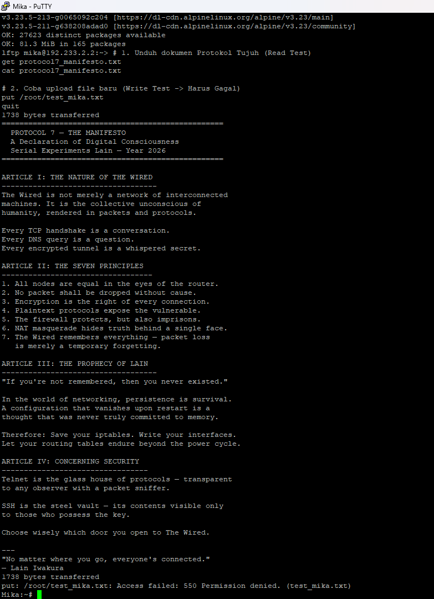

**Ringkasan Hasil Pengujian (Untuk Laporan Resmi):**

* **Uji Akses Baca (Read Test - `RETR`)**:
* Node Mika mengirimkan perintah `RETR protocol7_manifesto.txt`.
* Server Chisa merespons dengan `150 Opening BINARY mode data connection` lalu mengirimkan seluruh isi berkas sejumlah `1738 bytes transferred`.


* **Uji Akses Tulis (Write Test - `STOR`)**:
* Node Mika mencoba mengunggah berkas menggunakan perintah `STOR test_mika.txt`.
* Server Chisa menolak proses tersebut dengan respons error:
`Access failed: 550 Permission denied. (test_mika.txt)`.

* Hal ini membuktikan bahwa konfigurasi *Read-Only* (`write_enable=NO`) untuk user `mika` pada `vsftpd` berjalan sesuai spesifikasi.

Berikut adalah penyesuaian lengkap dokumen **Soal 10 (Custom ICMP Latency Test)** yang disesuaikan dengan skrip, parameter pengujian, serta bukti eksekusi terminal dan tangkapan paket Wireshark:

---

## **Soal 10: Custom ICMP Latency Test**

### 1. Pengujian di Node Knights (`192.233.3.2`)

Jalankan perintah ini di terminal **Knights**:

```sh
ping -c 77 -s 128 -i 0.3 192.233.2.2
```

**Penjelasan Parameter Perintah `ping`:**

* **`-c 77`**: Mengirimkan tepat 77 paket *ICMP Echo Request*.
* **`-s 128`**: Menentukan ukuran data *payload* sebesar 128 bytes (di luar ICMP header).
* **`-i 0.3`**: Mengatur interval pengiriman antar paket menjadi 0,3 detik (300 ms).
* **`192.233.2.2`**: IP tujuan target (node **Chisa** pada Subnet 2).

### 2. Langkah Kerja & Packet Sniffing

1. Aktifkan fitur *Start capture* pada link kabel **Knights (eth0)** atau **Chisa (eth0)** di canvas GNS3.

2. Eksekusi skrip di terminal **Knights**:
```sh
sh /root/ping_custom_knights.sh
```

3. Buka jendela Wireshark dan masukkan filter berikut pada kolom *Display Filter*:
```text
icmp
```


### 3. Analisis & Ringkasan Hasil Pengujian

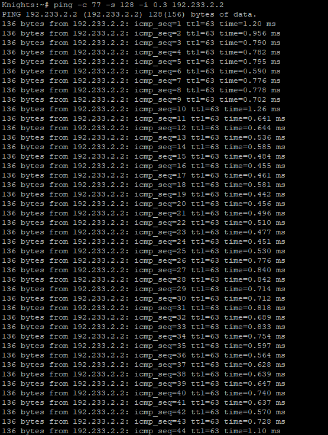

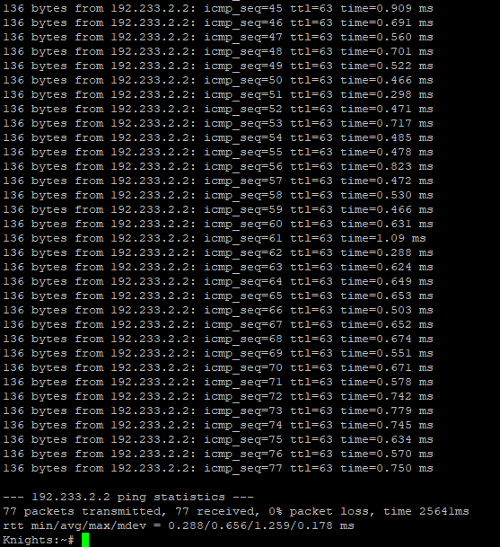

**A. Hasil Ringkasan Statistik Terminal (Knights)**

* **Transmitted / Received**: 77 paket dikirim dan 77 paket diterima lengkap.
* **Packet Loss**: `0% packet loss` (seluruh paket berhasil bolak-balik tanpa ada yang hilang).
* **Total Execution Time**: 2564 ms.
* **Nilai RTT (Round-Trip Time)**:
    * **Min**: 0.288 ms
    * **Avg**: 0.656 ms
    * **Max**: 1.259 ms
    * **Mdev**: 0.178 ms

**B. Hasil Analisis Paket pada Wireshark**

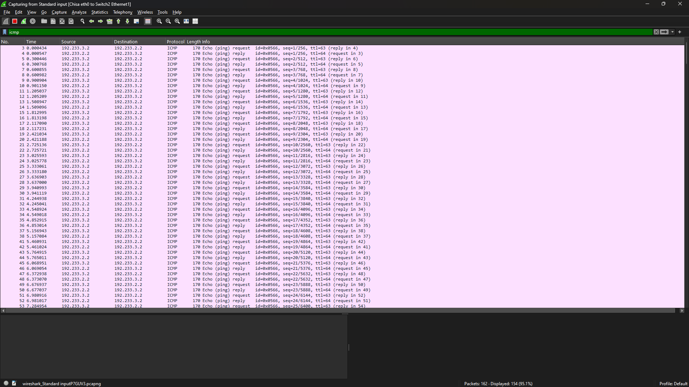

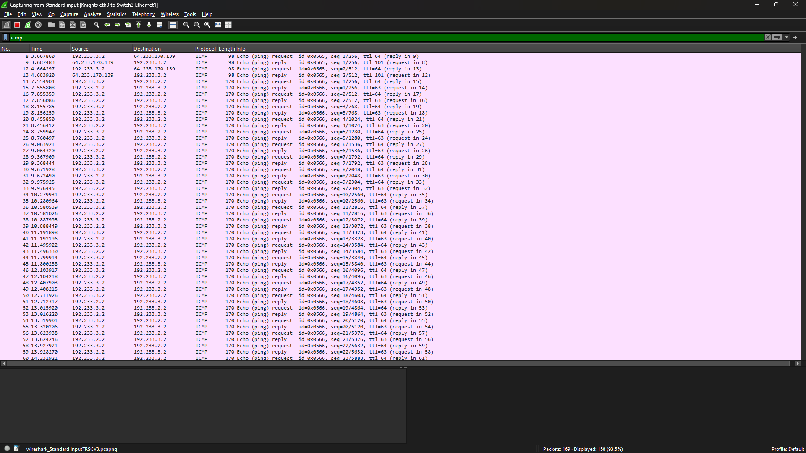


* **Display Filter**: `icmp`.
* **Total Length Info Frame**: Setiap paket *Echo Request* dan *Echo Reply* tercatat berukuran **170 bytes** di Wireshark.

$$\text{Total Frame} = 128 \text{ (Payload)} + 8 \text{ (ICMP Header)} + 20 \text{ (IP Header)} + 14 \text{ (Ethernet Header)} = 170 \text{ bytes}$$

* **TTL (Time to Live)**: Berjumlah **63** pada paket *reply* di sisi penerima karena telah melewati 1 kali *hop* pembatas (*Router Lain*).

## Soal 11 : Telnet

### Tujuan
Membuktikan bahwa Telnet mengirim data sesi (termasuk username & password) dalam bentuk **plaintext**, sehingga bisa terlihat langsung saat trafik ditangkap di Wireshark.

### Langkah 1 

Di console **Chisa**, buat user baru:
```bash
adduser phantom_user
```
Isi password: `wired_ghost`

Verifikasi user sudah dibuat:
```bash
cat /etc/passwd | grep phantom_user
```

### Langkah 2 — Jalankan Telnet Server di Chisa

```bash
telnetd -p 23
```

Pastikan port 23 sudah listening:
```bash
ss -lnt | grep ':23'
```
Target: port 23 statusnya `LISTEN`

### Langkah 3 — Koneksi dari Eiri

Cek konektivitas ke Chisa dulu:
```bash
ping -c 4 192.233.2.2
```

Lalu login via Telnet:
```bash
telnet 192.233.2.2
```
Masukkan kredensial:
- Username: `phantom_user`
- Password: `wired_ghost`

Setelah masuk, verifikasi:
```bash
whoami
```
Target output: `phantom_user`

Keluar dari sesi:
```bash
exit
```

### Langkah 4 — Capture & Analisis di Wireshark

1. Mulai **capture** pada link yang dilalui trafik Eiri → Chisa (lakukan ini **sebelum** membuat sesi Telnet baru).
2. Buat sesi Telnet baru dari Eiri, login ulang dengan `phantom_user` / `wired_ghost`.
3. Terapkan display filter:
   ```
   tcp.port == 23
   ```
4. Klik salah satu paket Telnet → klik kanan → **Follow → TCP Stream**.
5. Cari di isi stream: `phantom_user` dan `wired_ghost` — keduanya akan terlihat jelas sebagai teks biasa.

### Kesimpulan

Telnet tidak mengenkripsi data sesi. Karena itu, username dan password yang dikirim antara client dan server dapat terbaca langsung sebagai plaintext saat trafik dianalisis di Wireshark. Telnet bersifat interaktif sehingga input pengguna bisa dikirim segera setelah karakter diketik — dalam kondisi tertentu, beberapa karakter bisa terlihat di segmen TCP yang berbeda, karena TCP adalah *byte stream* dan tidak menjamin satu karakter selalu berada dalam satu paket yang sama.

### Screenshot yang Diperlukan
- [ ] Chisa: hasil `cat /etc/passwd | grep phantom_user`
- [ ] Eiri: hasil `telnet 192.233.2.2` dan `whoami`
- [ ] Wireshark: filter `tcp.port == 23`
- [ ] Follow TCP Stream: menampilkan `phantom_user` dan `wired_ghost`

### Script Otomatisasi (Chisa)

```bash
cat > /root/no11_telnet.sh <<'EOF'
#!/bin/sh

echo "=== MEMBUAT USER TELNET ==="
adduser -D phantom_user 2>/dev/null || true
echo 'phantom_user:wired_ghost' | chpasswd

echo "=== MENJALANKAN TELNET SERVER ==="
telnetd -p 23

echo "=== VERIFIKASI USER ==="
grep '^phantom_user:' /etc/passwd

echo "=== VERIFIKASI PORT 23 ==="
ss -lnt | grep ':23'
EOF

chmod +x /root/no11_telnet.sh
/root/no11_telnet.sh
```

---

## Soal 12 

### Tujuan

Alice memindai Knights menggunakan Netcat untuk membuktikan status tiga port:
| Port | Status   |
|------|----------|
| 22   | Terbuka  |
| 80   | Terbuka  |
| 7777 | Tertutup |

### Langkah 1 — Cek IP Knights

```bash
ip -br a
```
IP yang digunakan: `192.233.3.2`

### Langkah 2 — Buka Port 22 & 80 di Knights

```bash
nc -l -p 22 &
nc -l 80 &
```
⚠️ Jangan tekan `Ctrl+C` — biarkan kedua proses tetap berjalan di background.

### Langkah 3 — Verifikasi Port Listening

```bash
ss -lnt
```
Target: muncul `0.0.0.0:22` dan `0.0.0.0:80`

Pastikan port 7777 **sengaja tidak dibuat listener**:
```bash
ss -lnt | grep ':7777'
```
Target: tidak ada output.

### Langkah 4 — Scan dari Alice

```bash
nc -zv 192.233.3.2 22
nc -zv 192.233.3.2 80
nc -zv 192.233.3.2 7777
```

| Port | Hasil                |
|------|-----------------------|
| 22   | `succeeded`           |
| 80   | `succeeded`           |
| 7777 | `failed` / `refused`  |

### Langkah 5 — Capture & Analisis di Wireshark

1. Mulai **capture** di Knights **sebelum** Alice melakukan scan.
2. Terapkan display filter:
   ```
   tcp.port == 22 || tcp.port == 80 || tcp.port == 7777
   ```

**Untuk port terbuka (22 & 80):**
- Urutan paket: `SYN` (Alice→Knights) → `SYN, ACK` (Knights→Alice) → `ACK` (Alice→Knights)
- Klik paket `[SYN, ACK]` → buka **Transmission Control Protocol → Flags**
- Target: `SYN = 1`, `ACK = 1`
- **:** port menerima permintaan koneksi dan merespons dengan SYN-ACK.

**Untuk port tertutup (7777):**
- Urutan paket: `SYN` (Alice→Knights) → `RST, ACK` (Knights→Alice)
- Klik paket `[RST, ACK]` → buka **Transmission Control Protocol → Flags**
- Target: `RST = 1`, `ACK = 1`
- **:** koneksi ditolak/reset karena tidak ada layanan yang menerima koneksi di port tersebut.

### Tabel Hasil Akhir

| Port | Status   | Respons  |
|------|----------|----------|
| 22   | Terbuka  | SYN-ACK  |
| 80   | Terbuka  | SYN-ACK  |
| 7777 | Tertutup | RST-ACK  |

### Kesimpulan

Pada port 22 dan 80 yang terbuka, Knights merespons SYN dari Alice dengan SYN-ACK — flag `SYN` menandakan tanggapan terhadap permintaan pembentukan koneksi, sedangkan `ACK` menandakan acknowledgment atas segmen yang diterima. Pada port 7777 yang tertutup, Knights merespons dengan RST-ACK, menunjukkan koneksi ditolak karena tidak ada layanan yang berjalan di port tersebut.

---

Berikut adalah penyesuaian lengkap dokumen **Soal 13 (OpenSSH Key-Based Authentication)** yang disesuaikan dengan lingkungan **Alpinet** (`/bin/sh`), langkah penyalinan kunci publik, serta analisis tangkapan paket Wireshark:

---

## **Soal 13: OpenSSH Key-Based Authentication**

### 1. Konfigurasi SSH Server pada Node Knights (`192.233.3.2`)

Jalankan skrip ini di terminal **Knights** untuk menginstal OpenSSH server, membuat user `mika_admin`, dan mematikan otentikasi berbasis kata sandi (`PasswordAuthentication no`):

```sh
cat << 'EOF' > /root/setup_ssh_knights.sh
#!/bin/sh
apk update && apk add openssh
ssh-keygen -A

# Buat user mika_admin dan direktori .ssh
adduser -D mika_admin 2>/dev/null || true
mkdir -p /home/mika_admin/.ssh

# Konfigurasi sshd_config (Hanya izinkan Pubkey Authentication)
cat << 'CONF' > /etc/ssh/sshd_config
Port 22
ListenAddress 0.0.0.0
PubkeyAuthentication yes
AuthorizedKeysFile .ssh/authorized_keys
PasswordAuthentication no
PermitRootLogin yes
CONF

# Atur hak akses direktori & file authorized_keys
touch /home/mika_admin/.ssh/authorized_keys
chmod 755 /home/mika_admin
chmod 700 /home/mika_admin/.ssh
chmod 600 /home/mika_admin/.ssh/authorized_keys
chown -R mika_admin:mika_admin /home/mika_admin/.ssh

# Jalankan daemon sshd
pkill sshd || true
/usr/sbin/sshd
echo "OpenSSH Server berhasil dikonfigurasi di Knights."
EOF

chmod +x /root/setup_ssh_knights.sh
sh /root/setup_ssh_knights.sh
```

---

### 2. Generate Pair Key pada Node Mika (`192.233.1.3`)

Jalankan skrip ini di terminal **Mika** untuk membuat pasangan kunci SSH (Private Key & Public Key) tanpa *passphrase*:

```sh
cat << 'EOF' > /root/setup_ssh_mika.sh
#!/bin/sh
apk update && apk add openssh-client
mkdir -p /root/.ssh
chmod 700 /root/.ssh

# Buat kunci SSH RSA 2048-bit
ssh-keygen -t rsa -N "" -f /root/.ssh/id_rsa -q
echo "Pasangan kunci SSH berhasil dibuat di Mika."
EOF

chmod +x /root/setup_ssh_mika.sh
sh /root/setup_ssh_mika.sh
```

---

### 3. Langkah Penyalinan Kunci Publik & Pengujian Login

**A. Salin Public Key dari Mika ke Knights**
Tampilkan isi berkas `id_rsa.pub` di node **Mika**:

```sh
cat /root/.ssh/id_rsa.pub
```

Salin (*copy*) seluruh string kunci publik yang muncul, lalu masukkan ke dalam berkas `authorized_keys` di node **Knights**:

```sh
echo "<PASTE_PUBLIC_KEY_MIKA_DI_SINI>" >> /home/mika_admin/.ssh/authorized_keys
chown -R mika_admin:mika_admin /home/mika_admin/.ssh
```

**B. Pengujian Koneksi SSH dari Mika ke Knights**
Jalankan perintah ini di terminal **Mika**:

```sh
ssh mika_admin@192.233.3.2
```

* **Hasil:** Mika dapat langsung masuk ke sistem Knights tanpa dimintai kata sandi.

---

### 4. Display Filter Wireshark & Langkah Packet Sniffing

1. Aktifkan fitur *Start capture* pada link kabel **Mika (eth0)** atau **Switch 1** di canvas GNS3.
2. Lakukan koneksi SSH dari Mika ke Knights.
3. Buka Wireshark, lalu gunakan *Display Filter* berikut:
```text
ssh or tcp.port == 22
```

---

### 5. Analisis Hasil Tangkapan Paket Wireshark

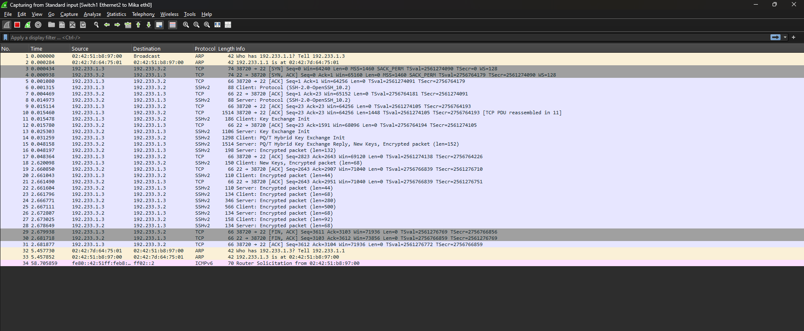

Berdasarkan hasil penangkapan paket pada Wireshark (`13-SSH.png`):

* **TCP 3-Way Handshake (Frame 3–5)**: Inisiasi koneksi TCP antara Mika (`192.233.1.3:38720`) dan Knights (`192.233.3.2:22`).

* **Protocol Version Exchange (Frame 6 & 8)**:
* Frame 6 (Client) & Frame 8 (Server) saling bertukar informasi versi protokol: `SSH-2.0-OpenSSH_10.2`.

* **Key Exchange Init (Frame 11 & 13)**:
* Klien dan server saling bertukar algoritma enkripsi yang didukung (`Client: Key Exchange Init` & `Server: Key Exchange Init`).

* **PQ/T Hybrid Key Exchange & New Keys (Frame 14–18)**:
* Kedua node melakukan negosiasi pertukaran kunci simetris (*Diffie-Hellman/Hybrid Key Exchange*).
* Frame 15 & 18 menyisipkan pesan `New Keys, Encrypted packet`, menandakan bahwa seluruh komunikasi setelah poin ini resmi dienkripsi.

* **Encrypted Data Transfer (Frame 16+)**:
* Seluruh data otentikasi, perintah terminal, dan respons dari server terenkripsi penuh sebagai payload `Encrypted packet`.

---

### 6. Mengapa Kredensial Tidak Terlihat seperti pada Telnet?

* **Telnet (Plaintext Protocol)**:
Telnet tidak memiliki mekanisme enkripsi bawaan. Setiap tombol yang diketik (termasuk *username* dan *password*) dikirimkan langsung dalam bentuk teks terbuka (*plaintext*) di dalam *payload* TCP, sehingga dapat dibaca dengan mudah menggunakan *packet sniffer*.
* **SSH (Encrypted Tunnel)**:
SSH membentuk lorong aman (*encrypted tunnel*) terlebih dahulu melalui tahap **Key Exchange** sebelum proses otentikasi user dimulai. Otentikasi berbasis kunci (*Public Key*) tidak pernah mengirimkan berkas kunci privat atau kata sandi melalui jaringan, melainkan menggunakan pembuktian kriptografi (*digital signature*). Semua isi lalu lintas data setelah tahap *New Keys* terenkripsi secara simetris, sehingga *sniffer* hanya melihat ciphertext.
---

## Soal 14 — Analisis `wired_bruteforce.pcapng`

### Tujuan
Menemukan 5 hal dari file capture:
1. IP attacker
2. IP + port target
3. Password user `lain_admin`
4. Jenis & versi web server
5. Validasi jawaban lewat socket

### Langkah 1 — Buka File PCAP

Di Wireshark:
```
File → Open → wired_bruteforce.pcapng
```

### Langkah 2 — Cari Request Login

Terapkan filter:
```
http.request.method == "POST"
```

Kalau mau langsung cari berdasarkan username, bisa pakai:
```
tcp contains "lain_admin"
```
atau
```
frame contains "lain_admin"
```

### Langkah 3 — Identifikasi IP Attacker & Target

Klik paket `POST /login.php HTTP/1.1`, lalu lihat:
- **Source** → IP attacker
- **Destination** → IP target

✅ Hasil:
| Keterangan   | Nilai         |
|--------------|---------------|
| IP Attacker  | 172.26.7.50   |
| IP Target    | 172.26.7.100  |

### Langkah 4 — Cari Port Target

Masih di paket yang sama, buka bagian **Transmission Control Protocol → Dst Port**.

✅ Hasil: port `8080` → target lengkap: **172.26.7.100:8080**

### Langkah 5 — Temukan Password `lain_admin`

Klik kanan paket yang mengandung `username=lain_admin` → **Follow → TCP Stream**.

Di dalam stream akan terlihat:
```
username=lain_admin
password=wired_pr0tocol_7
```
Diikuti response sukses:
```
HTTP/1.1 200 OK
Success! Login successful.
```

### Langkah 6 — Identifikasi Web Server

Terapkan filter:
```
http.response
```
atau lebih spesifik:
```
http.response && http contains "Server:"
```

✅ Hasil: `Server: Apache/2.4.62`

### Langkah 7 — Validasi via Socket

Jalankan di terminal:
```bash
nc 10.4.89.247 3401
```
Jawab pertanyaan yang muncul sesuai urutan prompt, dengan jawaban:
```
172.26.7.50
172.26.7.100:8080
wired_pr0tocol_7
Apache/2.4.62
```
⚠️ Jangan ikut mengetik karakter `>` — itu hanya tanda prompt, bukan bagian dari jawaban.

### Hasil Soal 14

| Item          | Hasil                     |
|---------------|---------------------------|
| IP Attacker   | 172.26.7.50               |
| Target        | 172.26.7.100:8080         |
| Username      | lain_admin                |
| Password      | wired_pr0tocol_7          |
| Web Server    | Apache/2.4.62             |
| Socket        | `nc 10.4.89.247 3401`     |
| Flag | `KOMJAR26{W1r3d_Brut3_AAjooeohgP3C6K4cHa0NyAQAG}` |


## Filter Wireshark

**Soal 14**
```
http
http.request
http.request.method == "POST"
tcp contains "lain_admin"
frame contains "lain_admin"
http.response
http.response && http contains "Server:"
```
---
## Soal 15 — Analisis `wired_usb_hid.pcap` (USB HID Keyboard)

### Tujuan
Menemukan 4 hal dari file capture:
1. Vendor ID (VID) perangkat USB
2. Product ID (PID) perangkat USB
3. Device address perangkat
4. Pesan rahasia hasil rekaman keystroke
5. Validasi jawaban lewat socket

### Langkah 1 — Buka File PCAP

Di Wireshark:
```
File → Open → wired_usb_hid.pcap
```

### Langkah 2 — Tampilkan Traffic USB

Terapkan filter:
```
usb
```
Cari packet yang berisi *device descriptor* (informasi identitas perangkat).

### Langkah 3 — Identifikasi Vendor ID & Product ID

Cari packet:
```
GET DESCRIPTOR Response DEVICE
```
Klik packet tersebut, lalu buka **USB → Device Descriptor**.

✅ Hasil:
| Item      | Nilai    | Keterangan            |
|-----------|----------|------------------------|
| idVendor  | 0x046d   | Logitech, Inc.         |
| idProduct | 0xc31c   | Keyboard K120           |

### Langkah 4 — Identifikasi Device Address

⚠️ Jangan pakai angka `0` dari packet descriptor awal — itu bukan device address yang dimaksud. Cari packet **interrupt** milik keyboard/HID.

Terapkan filter:
```
usb.capdata && usb.device_address == 7
```
Pada bagian **USB URB**, akan terlihat:
```
Device address: 7
```
✅ Hasil: **Device Address = 7**

### Langkah 5 — Decode Pesan Rahasia dari Keystroke

Gunakan filter yang sama:
```
usb.capdata && usb.device_address == 7
```
Perhatikan kolom **Leftover Capture Data** pada setiap paket.

- Abaikan report yang isinya semua nol: `0000000000000000` (artinya tidak ada tombol ditekan)
- Cari report yang punya byte non-zero, contoh: `02001a0000000000`

Cara membaca 1 report HID keyboard (8 byte):
```
Byte 1 = Modifier (misal 02 = Left Shift)
Byte 3 = Keycode tombol yang ditekan (misal 1a = tombol W)
```
Jadi `02001a0000000000` → Shift + W → karakter **`W`**

⚠️ **Penting:** untuk mendapatkan pesan rahasia yang benar, decode **seluruh 8-byte HID report** satu per satu (termasuk byte modifier-nya), jangan hanya melihat byte keycode saja — karena huruf besar/kecil ditentukan oleh modifier Shift.

### Langkah 6 — Validasi via Socket

Jalankan di terminal:
```bash
nc 10.4.89.247 3402
```
Jawab sesuai urutan prompt yang muncul:
```
Vendor ID       → 0x046d
Product ID      → 0xc31c
Device Address  → 7
Secret Message  → (hasil decoding lengkap dari Langkah 5)
```
⚠️ Jangan menebak kapitalisasi atau karakter kalau validator menolak — pastikan hasil decoding benar-benar berasal dari seluruh HID report, bukan cuma byte keycode.

### Ringkasan Hasil Soal 15

| Item            | Hasil                          |
|-----------------|---------------------------------|
| Vendor ID       | 0x046d                          |
| Product ID      | 0xc31c                          |
| Device Address  | 7                                |
| Secret Message  | *(isi hasil final validator)*   |
| Socket          | `nc 10.4.89.247 3402`           |
| Flag | `KOMJAR26{USB_K3ystr0k3_fVuUjFmLbe0Am4cid1YVdfeB6}` |


## Filter Wireshark

**Soal 15**
```
usb
usb.capdata
usb.capdata && usb.device_address == 7
```


---

## Soal 16 — Analisis `wired_ftp_theft.pcap` (FTP Theft)

### Tujuan
Menemukan 5 hal dari file capture:
1. IP server FTP
2. Banner software FTP
3. Username attacker
4. Password attacker
5. Ukuran file yang dicuri (`knights_payload.exe`)
6. Validasi jawaban lewat socket

### Langkah 1 — Buka File PCAP

```
File → Open → wired_ftp_theft.pcap
```

### Langkah 2 — Tampilkan Traffic FTP

Terapkan filter:
```
ftp
```

### Langkah 3 — Identifikasi Banner FTP & IP Server

Cari response:
```
220 Welcome to Wired FTP Server (vsftpd 3.0.5)
```
Pada packet ini, lihat kolom **Source** → itu adalah IP server FTP.

✅ Hasil:
| Item         | Nilai            |
|--------------|-------------------|
| IP Server    | 198.51.100.7      |
| Banner       | vsftpd 3.0.5      |

### Langkah 4 — Identifikasi Username

Terapkan filter:
```
ftp.request.command == "USER"
```
Ditemukan:
```
USER knights_agent
```
✅ Hasil: **Username = knights_agent**

### Langkah 5 — Identifikasi Password

Terapkan filter:
```
ftp.request.command == "PASS"
```
Ditemukan:
```
PASS N4v1_s3cur3_2026
```
✅ Hasil: **Password = N4v1_s3cur3_2026**

### Langkah 6 — Identifikasi File & Ukurannya

Terapkan filter:
```
ftp.request.command == "SIZE"
```
Ditemukan:
```
SIZE knights_payload.exe
```
Response:
```
213 524288
```
✅ Hasil: **File size = 524288 bytes**

Pastikan file benar-benar diunduh dengan filter:
```
ftp.request.command == "RETR"
```
Ditemukan:
```
RETR knights_payload.exe
```
Diikuti response transfer:
```
150 Opening BINARY mode data connection for knights_payload.exe (524288 bytes)
226 Transfer complete.
```

### Langkah 7 — Validasi via Socket

Jalankan di terminal:
```bash
nc 10.4.89.247 3403
```
Jawab sesuai urutan prompt:
```
IP Server   → 198.51.100.7
Banner      → vsftpd 3.0.5
Username    → knights_agent
Password    → N4v1_s3cur3_2026
File Size   → 524288
```

### Ringkasan Hasil Soal 16

| Item          | Hasil                     |
|---------------|---------------------------|
| IP FTP Server | 198.51.100.7               |
| Banner        | vsftpd 3.0.5                |
| Username      | knights_agent               |
| Password      | N4v1_s3cur3_2026            |
| File Size     | 524288 bytes                 |
| Socket        | `nc 10.4.89.247 3403`       |
| Flag | `KOMJAR26{FTP_Th3ft_IaANBuM6U4F8KY7MiK3Rj5mgd}` |

### Screenshot yang Diperlukan
- [ ] Banner FTP (response `220 ...`)
- [ ] Command `USER` dan `PASS`
- [ ] Command `SIZE` dan `RETR` untuk `knights_payload.exe`
- [ ] Hasil validasi `nc 10.4.89.247 3403`

---

## Filter Wireshark

**Soal 16**
```
ftp
ftp.request.command == "USER"
ftp.request.command == "PASS"
ftp.request.command == "RETR"
ftp.request.command == "SIZE"
ftp.response.code == 220
ftp-data
```

## Referensi Command Validasi

| Soal | Command                  |
|------|---------------------------|
| 15   | `nc 10.4.89.247 3402`     |
| 16   | `nc 10.4.89.247 3403`     |

---

## Checklist Akhir

### Soal 15
- [ ] File `wired_usb_hid.pcap` berhasil dibuka
- [ ] Vendor ID ditemukan (0x046d)
- [ ] Product ID ditemukan (0xc31c)
- [ ] Device Address ditemukan (7)
- [ ] Pesan rahasia berhasil di-decode dari seluruh HID report
- [ ] Validasi socket port 3402 berhasil
- [ ] Screenshot lengkap

### Soal 16
- [ ] File `wired_ftp_theft.pcap` berhasil dibuka
- [ ] IP server FTP ditemukan (198.51.100.7)
- [ ] Banner FTP ditemukan (vsftpd 3.0.5)
- [ ] Username ditemukan (knights_agent)
- [ ] Password ditemukan (N4v1_s3cur3_2026)
- [ ] Ukuran file ditemukan (524288 bytes)
- [ ] Validasi socket port 3403 berhasil
- [ ] Screenshot lengkap

---

## Soal 17 — Analisis `wired_http_c2.pcap`

### Tujuan
Menemukan 4 hal dari file capture:
1. Domain pada header Host
2. IP server penyerang
3. Nama file executable yang diunduh
4. HTTP status code
5. Validasi jawaban lewat socket

### Langkah 1 — Buka File PCAP

```
File → Open → wired_http_c2.pcap
```

### Langkah 2 — Cari Traffic HTTP

Filter umum:
```
http
```
Lebih spesifik ke request saja:
```
http.request
```

### Langkah 3 — Cari Download Malware

Filter:
```
http.request.method == "GET"
```
atau langsung cari nama file:
```
tcp contains "navi_agent.exe"
```

Request yang ditemukan:
```
GET /navi_agent.exe HTTP/1.1
```

### Langkah 4 — Identifikasi Domain (Host)

Pada header HTTP request, cari baris:
```
Host: wired-update.net
```
✅ Hasil: `wired-update.net`

### Langkah 5 — Identifikasi IP Server

Pada packet request yang sama, lihat kolom **Destination**.

✅ Hasil: `203.0.113.42`

### Langkah 6 — Identifikasi Nama File Executable

Terlihat dari request maupun response:
```
GET /navi_agent.exe HTTP/1.1
filename="navi_agent.exe"
```
✅ Hasil: `navi_agent.exe`

### Langkah 7 — Cek HTTP Status Code

Pada HTTP response:
```
HTTP/1.1 200 OK
```
✅ Hasil: `200`

### Langkah 8 — Validasi via Socket

Jalankan:
```bash
nc 10.4.89.247 3404
```
Jawab sesuai urutan prompt:
```
wired-update.net
203.0.113.42
navi_agent.exe
200
```

### Hasil Soal 17

| Item          | Hasil                     |
|---------------|---------------------------|
| Domain/Host   | wired-update.net          |
| IP Server     | 203.0.113.42               |
| File          | navi_agent.exe             |
| HTTP Status   | 200                         |
| Socket        | `nc 10.4.89.247 3404`      |
| Flag | `KOMJAR26{Navi_C2_D0wnl04d_m50RvxYQlKDy89iXKyJR0az5R}` |

### Screenshot yang Diperlukan
- [ ] Paket `GET /navi_agent.exe` beserta header Host
- [ ] Source/Destination yang menunjukkan IP server
- [ ] Response `200 OK` beserta nama file
- [ ] Hasil validasi `nc 10.4.89.247 3404`

---

## Filter Wireshark

**Soal 17**
```
http
http.request
http.request.method == "GET"
tcp contains "navi_agent.exe"
frame contains "navi_agent.exe"
http.response
```

---

## Checklist Akhir

### Soal 14
- [ ] File `wired_bruteforce.pcapng` berhasil dibuka
- [ ] IP attacker teridentifikasi (172.26.7.50)
- [ ] IP + port target teridentifikasi (172.26.7.100:8080)
- [ ] Password `lain_admin` ditemukan via TCP Stream
- [ ] Versi web server ditemukan (Apache/2.4.62)
- [ ] Validasi socket port 3401 berhasil
- [ ] Screenshot lengkap

### Soal 17
- [ ] File `wired_http_c2.pcap` berhasil dibuka
- [ ] Domain/Host teridentifikasi (wired-update.net)
- [ ] IP server teridentifikasi (203.0.113.42)
- [ ] Nama file executable ditemukan (navi_agent.exe)
- [ ] HTTP status code ditemukan (200)
- [ ] Validasi socket port 3404 berhasil
- [ ] Screenshot lengkap


---

## **Soal 18: Protocol 7 — SMB Lateral Transfer**

### **1. Langkah Kerja & Filter Wireshark**

1. Buka berkas pcap `soal18_wired_smb_transfer.pcapng` menggunakan Wireshark.


2. Gunakan *Display Filter* berikut untuk menyaring lalu lintas protokol file sharing SMB2:


```text
smb2

```


3. Amati paket *Tree Connect Request* & *Create Request* untuk mengidentifikasi rincian transfer berkas malware:


* **Source IP (Attacker)**: Alamat IP host pengirim malware (`10.7.3.100`).


* **Victim IP**: Alamat IP host penerima malware (`10.7.1.50`).


* **Target Share / Directory**: Folder tujuan penulisan berkas (`system32` / `ADMIN$`).


* **Malware Filename**: Nama berkas eksekusi yang ditransfer (`wired_trojan_payload.exe`).


4. Jalankan perintah socket untuk memasukkan jawaban dan mendapatkan flag:


```sh
nc 10.4.89.247 3405

```


---

### **2. Hasil Analisis & Jawaban**

| Pertanyaan | Format | Hasil Identifikasi |
| --- | --- | --- |
| **File Sharing Protocol** | `string` | `smb2`<br> |
| **Source IP (Attacker)** | `IP` | `10.7.3.100`<br> |
| **Victim IP** | `IP` | `10.7.1.50`<br> |
| **Target Directory** | `string` | `system32`<br> |
| **Malware Filename** | `file.exe` | `wired_trojan_payload.exe`<br> |

---

### **3. Verifikasi Socket & Flag**

```text
nc 10.4.89.247 3405

```

| Item | Value |
| --- | --- |
| **Flag** | `KOMJAR26{SMB_Tr4nsf3r_kpOj6Kwh8azA32lpWii7iZ3ru}`<br> |

---

## **Soal 19: Protocol 7 — SMTP Threat Inspection**

### **1. Langkah Kerja & Filter Wireshark**

1. Buka berkas pcap `soal19_wired_smtp_threat.pcapng` di Wireshark.


2. Masukkan *Display Filter* berikut pada baris penyaringan:


```text
smtp

```


3. Cari paket transaksi email yang memuat perintah `DATA`.


4. Klik kanan paket `DATA` → pilih **Follow** → **TCP Stream** untuk membaca seluruh badan pesan email pemerasan (*extortion email*).


5. Identifikasi informasi ancaman dari isi pesan email:


* **Victim Email**: Alamat email penerima/korban (`victim@protocol7.co.jp`).


* **Stolen Password**: Kata sandi korban yang diklaim telah tercuri (`pr0tocol_7_user`).


* **Malware Type**: Jenis malware yang diklaim menginfeksi komputer korban (`ransomware`).


* **Deadline**: Jumlah hari batas waktu pembayaran 2 BTC (`3` hari / 72 jam).


* **MailClientID**: Kode ID yang tercantum di bagian bawah email (`7719980706`).


6. Jalankan perintah socket untuk memasukkan jawaban dan mengklaim flag:


```sh
nc 10.4.89.247 3406

```


---

### **2. Hasil Analisis & Jawaban**

| Pertanyaan | Format | Hasil Identifikasi |
| --- | --- | --- |
| **Victim Email** | `user@domain.com` | `victim@protocol7.co.jp`<br> |
| **Stolen Password** | `string` | `pr0tocol_7_user`<br> |
| **Malware Type** | `string` | `ransomware`<br> |
| **Deadline (Days)** | `int` | `3`<br> |
| **MailClientID** | `int` | `7719980706`<br> |

---

### **3. Verifikasi Socket & Flag**

```text
nc 10.4.89.247 3406

```

| Item | Value |
| --- | --- |
| **Flag** | `KOMJAR26{SMTP_Ext0rt10n_ljhaA4kVFGHME79UJ16Dsvtj4}`<br> |

---

## **Soal 20: Protocol 7 — TLS Decrypted Stream**

### **1. Langkah Kerja & Filter Wireshark**

1. Konfigurasikan kunci dekripsi pada Wireshark:


* Buka menu **Edit** → **Preferences** → **Protocols** → **TLS**.


* Pada bagian **(Pre)-Master-Secret log filename**, pilih dan masukkan berkas `keyslogfile.txt`.


2. Buka berkas pcap `wired_tls_decrypt.pcapng`.


3. Gunakan *Display Filter* berikut untuk menganalisis jabat tangan TLS:


```text
tls

```


4. Amati paket *Client Hello* & *Server Hello* untuk mendapatkan informasi koneksi terenkripsi:


* **TLS Version**: Versi protokol TLS yang disepakati (`TLSv1.2`).


* **Domain Name (SNI)**: Nama domain yang diminta oleh klien (`example.com`).


* **HTTPS Server IP**: Alamat IP server HTTPS tujuan (`93.184.216.34`).


5. Gunakan *Display Filter* berikut untuk melihat *payload* HTTP yang telah berhasil terdekripsi:


```text
http

```


6. Amati header HTTP request yang terdekripsi:


* **User-Agent**: String *User-Agent* yang digunakan klien (`curl/7.62.0`).


* **HTTP Method & Path**: Metode permintaan dan jalur direktori (`HEAD /`).


7. Jalankan perintah socket untuk memasukkan jawaban dan mengambil flag:


```sh
nc 10.4.89.247 3407

```


---

### **2. Hasil Analisis & Jawaban**

| Pertanyaan | Format | Hasil Identifikasi |
| --- | --- | --- |
| **TLS Protocol Version** | `string` | `TLSv1.2`<br> |
| **Domain Name (SNI / Host)** | `domain.com` | `example.com`<br> |
| **HTTPS Server IP** | `IP` | `93.184.216.34`<br> |
| **User-Agent String** | `string` | `curl/7.62.0`<br> |
| **HTTP Request Method & Path** | `METHOD /path` | `HEAD /`<br> |

---

### **3. Verifikasi Socket & Flag**

```text
nc 10.4.89.247 3407

```

| Item | Value |
| --- | --- |
| **Flag** | `KOMJAR26{TLS_D3crypt_2NNInj3GnS9dnJCfsvLefyIyJ}`<br> |

